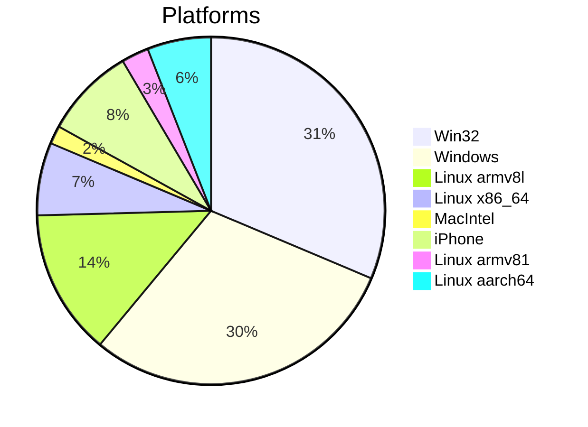
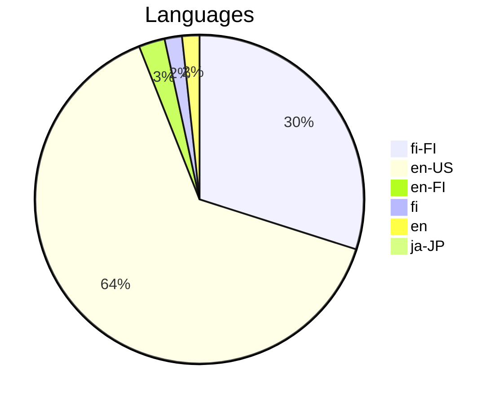

# Weekly Data Report

Generated at: 2026-02-14T18:01:19.796Z

## Recent Visitors (visitorsV2)

**Total Unique Visitors (in this sample): 98**

### Visualizations

#### Platform Distribution

#### Language Distribution

| Timestamp                | Visitor ID                           | Platform      | Language | Screen    | Unique? |
| ------------------------ | ------------------------------------ | ------------- | -------- | --------- | ------- |
| 2026-02-14T17:18:48.670Z | 9e5ea7c8-483b-4a79-b31b-61ad82fcb4b6 | Win32         | fi-FI    | 2560x1440 | ✅      |
| 2026-02-14T16:34:08.701Z | dee070e8-0736-4205-b677-75883a2a7f84 | Win32         | fi-FI    | 2560x1440 | ✅      |
| 2026-02-14T16:34:08.145Z | dee070e8-0736-4205-b677-75883a2a7f84 | Win32         | fi-FI    | 2560x1440 | —       |
| 2026-02-14T16:07:49.409Z | 9e5ea7c8-483b-4a79-b31b-61ad82fcb4b6 | Win32         | fi-FI    | 2560x1440 | —       |
| 2026-02-14T16:02:47.849Z | dee070e8-0736-4205-b677-75883a2a7f84 | Win32         | fi-FI    | 2560x1440 | —       |
| 2026-02-14T07:52:28.721Z | 62426390-161e-417f-8813-8c306d0839c3 | Windows       | en-US    | 2000x2000 | ✅      |
| 2026-02-14T07:52:09.338Z | 09d906b2-30c4-4749-8a2a-7dd0c2aabe7a | Linux armv8l  | en-US    | 412x915   | ✅      |
| 2026-02-07T15:06:53.346Z | d6022104-7aad-4a2f-af54-4e1886f9099f | Windows       | en-US    | 2000x2000 | ✅      |
| 2026-02-04T12:43:00.693Z | 76667d90-62a8-42c6-b80a-872b1c468016 | Win32         | en-US    | 2560x1440 | ✅      |
| 2026-02-02T18:29:05.135Z | 7866378b-3818-4441-848b-20a35fa4f272 | Linux armv8l  | en-US    | 412x915   | ✅      |
| 2026-01-28T09:19:29.166Z | 7abe12dc-4ee1-4e91-a840-82f874f99d8b | Win32         | en-US    | 1536x864  | ✅      |
| 2026-01-28T06:34:11.114Z | 76667d90-62a8-42c6-b80a-872b1c468016 | Win32         | en-US    | 2560x1440 | —       |
| 2026-01-27T06:51:25.815Z | 9980b3d3-1071-4ae1-8910-1f21a5fe25d1 | Linux x86_64  | en-US    | 800x600   | ✅      |
| 2026-01-23T18:06:25.976Z | e84737f6-4cfe-4cb2-90d0-cc497d7c33c9 | Linux armv8l  | en-US    | 412x915   | ✅      |
| 2026-01-21T12:18:15.838Z | e84011bd-0d6a-48da-ad5d-e45e38d0410d | MacIntel      | en-US    | 3440x1440 | ✅      |
| 2026-01-19T17:41:19.462Z | 0ae475f2-1b3e-4db3-9ddd-b1ce7eaffe98 | Windows       | en-US    | 2000x2000 | ✅      |
| 2026-01-16T12:10:56.697Z | 2b11a841-da59-4f2f-905b-38b6bd4ec967 | Win32         | fi-FI    | 3440x1440 | ✅      |
| 2026-01-14T21:10:14.140Z | 5b6e8c8a-d42f-465e-8aef-b9bf577fb082 | Windows       | en-US    | 2000x2000 | ✅      |
| 2026-01-14T08:24:56.693Z | 76667d90-62a8-42c6-b80a-872b1c468016 | Win32         | en-US    | 2560x1440 | —       |
| 2026-01-10T12:36:42.497Z | 775e2923-b5c1-4f53-a36f-1fa96bc47879 | iPhone        | en-US    | 2000x2000 | ✅      |
| 2026-01-06T16:09:08.377Z | 18a6beec-2d95-42e4-8355-3630c422ad9f | Win32         | en-FI    | 1536x864  | ✅      |
| 2026-01-05T18:34:34.074Z | 2f5ccda7-b3bc-4983-874b-f6ec8d9b4d73 | Linux armv8l  | en-US    | 412x915   | ✅      |
| 2026-01-01T07:13:40.068Z | 401d69f6-180c-44c1-938c-0cfd8f0d08be | Linux armv8l  | en-US    | 412x915   | ✅      |
| 2026-01-01T07:13:33.554Z | 7724b785-0c73-4c7a-af91-a3a0d70797f2 | Windows       | en-US    | 2000x2000 | ✅      |
| 2025-12-28T03:07:38.343Z | 2b18b4a2-2527-492e-b45c-ef55c4024cb6 | iPhone        | fi-FI    | 440x956   | ✅      |
| 2025-12-25T19:59:10.166Z | d2ddbfb8-ebc3-4993-bc91-3f6b3dd99d66 | iPhone        | en-US    | 2000x2000 | ✅      |
| 2025-12-19T10:00:19.717Z | 18a6beec-2d95-42e4-8355-3630c422ad9f | Win32         | en-FI    | 1536x864  | —       |
| 2025-12-19T01:12:56.544Z | e0e04295-220d-4037-a8e6-fa1da6901980 | Windows       | en-US    | 2000x2000 | ✅      |
| 2025-12-18T20:25:18.294Z | f823be4e-0947-4a22-96d9-02a2bc2a53c7 | Win32         | fi-FI    | 2195x1235 | ✅      |
| 2025-12-12T14:38:24.908Z | e4b4de44-983e-4464-bd41-f5067d3a9dc1 | Win32         | fi-FI    | 1920x1080 | ✅      |
| 2025-11-19T08:39:00.547Z | a8458e7a-abbc-43a1-b90f-2e2b5900b8fc | Win32         | fi       | 3440x1440 | ✅      |
| 2025-11-19T07:22:58.338Z | 76667d90-62a8-42c6-b80a-872b1c468016 | Win32         | en-US    | 2560x1440 | —       |
| 2025-11-16T10:58:27.105Z | 010e2f5a-77bc-4855-860f-1ad8d8b5647b | Windows       | en-US    | 2000x2000 | ✅      |
| 2025-11-01T23:55:16.661Z | 99c118bc-9c59-4782-97e8-3be71440b30a | Linux armv81  | fi-FI    | 385x854   | ✅      |
| 2025-11-01T23:54:58.486Z | 9eac2697-5f1b-4bd0-a505-dda9fd01340a | Linux aarch64 | fi-FI    | 385x854   | ✅      |
| 2025-11-01T09:19:00.130Z | f823be4e-0947-4a22-96d9-02a2bc2a53c7 | Win32         | fi-FI    | 2560x1440 | —       |
| 2025-10-31T17:03:25.523Z | 49eb3a56-4fee-4350-857e-6b65955b6946 | Win32         | en-US    | 1920x1080 | ✅      |
| 2025-10-29T10:34:10.395Z | a8458e7a-abbc-43a1-b90f-2e2b5900b8fc | Win32         | fi       | 3440x1440 | —       |
| 2025-10-28T15:12:03.932Z | 8dd766c2-504a-4c4c-8745-593c30f6d0c2 | Linux armv8l  | en-US    | 2000x2000 | ✅      |
| 2025-10-19T20:05:50.506Z | f823be4e-0947-4a22-96d9-02a2bc2a53c7 | Win32         | fi-FI    | 1920x1080 | —       |
| 2025-10-18T20:06:03.329Z | 931844a5-46ce-4e66-970e-9045223afb8c | Linux armv8l  | en-US    | 412x915   | ✅      |
| 2025-10-15T20:03:48.965Z | c0b8c497-7f84-4e16-8eef-630155308fa8 | Linux armv8l  | en-US    | 412x915   | ✅      |
| 2025-10-15T20:03:18.449Z | 6c82f826-0e68-4b63-b448-93f121d94876 | Windows       | en-US    | 2000x2000 | ✅      |
| 2025-10-15T20:03:00.420Z | 84fcf58e-bda5-4c18-945c-283030768bb8 | Linux armv8l  | en-US    | 412x915   | ✅      |
| 2025-10-15T20:02:19.077Z | b54f59c9-447a-4b6e-a978-0b7ac6e48858 | Windows       | en-US    | 2000x2000 | ✅      |
| 2025-10-12T17:21:02.940Z | 25cd414d-f598-473f-8f0b-67b020ae7bd2 | Windows       | en-US    | 2000x2000 | ✅      |
| 2025-09-29T18:34:35.766Z | 6a16620a-784f-49f5-94d6-cfef7bbd454f | MacIntel      | en-US    | 2000x2000 | ✅      |
| 2025-09-29T18:33:44.295Z | ab4f37ba-9609-447c-b5bd-f1643fb7face | Linux armv8l  | en-US    | 412x915   | ✅      |
| 2025-09-21T18:33:39.899Z | 2539977c-8f3c-410e-85fc-045bae637eb1 | Windows       | en-US    | 2000x2000 | ✅      |
| 2025-09-18T05:54:42.699Z | a4b235eb-1c00-4637-b848-9d1ee9d020c5 | Linux armv8l  | en-US    | 2000x2000 | ✅      |
| 2025-09-15T16:57:55.126Z | 5d041271-3990-42f2-aa5b-b519687c31db | Linux armv81  | fi-FI    | 412x869   | ✅      |
| 2025-09-12T15:39:57.396Z | e9ee1170-995a-45c2-ae3f-a68d0b9924a1 | Win32         | en       | 1920x1080 | ✅      |
| 2025-09-11T20:35:59.659Z | 51fc347a-7c50-4adf-8e6d-b4337e424101 | Win32         | en       | 1920x1080 | ✅      |
| 2025-09-06T19:01:40.195Z | c62de568-d66b-49d7-882a-61572806cb85 | Windows       | en-US    | 2000x2000 | ✅      |
| 2025-09-06T19:00:41.657Z | 4545e4ae-99a0-4c44-8fc7-150016b950d6 | Windows       | en-US    | 2000x2000 | ✅      |
| 2025-08-31T19:15:22.861Z | 6985d3f8-aca0-4a1e-930a-57fb73d03609 | Windows       | en-US    | 2000x2000 | ✅      |
| 2025-08-31T19:15:10.899Z | 8fda8ed1-d382-4d02-8f4b-106ce526a109 | Windows       | en-US    | 2000x2000 | ✅      |
| 2025-08-29T05:11:33.199Z | 28d4db12-82e8-45e1-912e-01f5e2d4e9f7 | Linux armv81  | fi-FI    | 384x854   | ✅      |
| 2025-08-28T13:35:59.862Z | b9ed566f-1bf5-460e-9ce7-4321e11755f9 | Win32         | en-US    | 2560x1440 | ✅      |
| 2025-08-28T13:35:12.154Z | 24911d90-0373-493f-baf5-f51e76f7df83 | Win32         | en-US    | 1920x1080 | ✅      |
| 2025-08-27T15:39:17.134Z | 4ff9332c-40bc-42c8-8bab-717b9124271f | Windows       | en-US    | 2000x2000 | ✅      |
| 2025-08-27T15:08:32.894Z | e0ec7637-9dfd-4498-bd1f-d1c20b12cfdb | iPhone        | fi-FI    | 390x844   | ✅      |
| 2025-08-27T13:37:51.393Z | 597c6692-ee04-4c56-8c6e-39c2865797d2 | Win32         | fi-FI    | 1920x1080 | ✅      |
| 2025-08-27T13:37:11.423Z | 130e54b1-b0d6-4884-9444-a176ac852865 | Win32         | fi-FI    | 1920x1080 | ✅      |
| 2025-08-27T13:35:20.055Z | 24911d90-0373-493f-baf5-f51e76f7df83 | Win32         | en-US    | 1920x1080 | —       |
| 2025-08-27T13:32:42.897Z | 2d86a436-f5ff-4755-82c1-29e54d8de389 | Win32         | fi-FI    | 1920x1080 | ✅      |
| 2025-08-27T13:31:18.360Z | e0ec7637-9dfd-4498-bd1f-d1c20b12cfdb | iPhone        | fi-FI    | 390x844   | —       |
| 2025-08-27T13:24:51.665Z | ddfaf0a4-5fb1-414f-97ca-c7de708bc912 | iPhone        | fi-FI    | 390x844   | ✅      |
| 2025-08-25T19:19:30.248Z | 47bac890-9c90-4ecd-a2af-c496e956af15 | iPhone        | fi-FI    | 390x844   | ✅      |
| 2025-08-22T21:14:26.996Z | f9c28f4d-a72f-420f-90dd-93efc7a53a4e | Linux aarch64 | ja-JP    | 412x915   | ✅      |
| 2025-08-21T19:50:17.870Z | 8da3f7aa-36f4-4e68-a6bd-25d5b7b744ec | Windows       | en-US    | 2000x2000 | ✅      |
| 2025-08-14T21:41:25.172Z | 8ec876d1-7fa9-46b9-86ac-ede6638594e1 | Windows       | en-US    | 2000x2000 | ✅      |
| 2025-08-14T21:40:48.411Z | cddecc43-a0d1-4644-9fc6-acbcf6447967 | Windows       | en-US    | 2000x2000 | ✅      |
| 2025-08-11T08:14:54.578Z | 76667d90-62a8-42c6-b80a-872b1c468016 | Win32         | en-US    | 2560x1440 | —       |
| 2025-08-11T07:34:07.348Z | 76667d90-62a8-42c6-b80a-872b1c468016 | Win32         | en-US    | 2560x1440 | —       |
| 2025-08-09T17:05:28.393Z | 789b6b94-7783-4694-be0b-eb1a76723e5e | Linux aarch64 | fi-FI    | 360x792   | ✅      |
| 2025-08-09T11:25:21.782Z | 13bcf8b6-a3a9-4587-af89-c801dd385870 | Linux armv8l  | en-US    | 2000x2000 | ✅      |
| 2025-08-03T02:15:00.458Z | d5c06686-6ec2-4ba4-b523-5501fba9a23e | Windows       | en-US    | 2000x2000 | ✅      |
| 2025-07-30T22:24:20.790Z | c54936f1-0238-4eb1-8079-d424993204c2 | Windows       | en-US    | 2000x2000 | ✅      |
| 2025-07-30T22:23:20.486Z | 1baf357a-ef86-426d-856f-92e0b40ebd35 | Windows       | en-US    | 2000x2000 | ✅      |
| 2025-07-28T21:47:00.212Z | c2894b36-4ef3-4c4d-a9b7-2ab09420ffcb | iPhone        | fi-FI    | 414x896   | ✅      |
| 2025-07-26T13:44:10.271Z | c5533028-d0c3-4e75-875c-503d3a86be59 | Windows       | en-US    | 2000x2000 | ✅      |
| 2025-07-26T13:41:02.976Z | dc3f75bb-c0ee-4293-a03c-2489e31ce00c | Windows       | en-US    | 2000x2000 | ✅      |
| 2025-07-22T17:19:41.646Z | 271694c6-8dff-4b9e-a7ee-9a87a321210d | Windows       | en-US    | 2000x2000 | ✅      |
| 2025-07-20T10:43:05.077Z | 7fb350cc-5ea6-4d3b-8132-1d7ea056c14c | iPhone        | fi-FI    | 414x896   | ✅      |
| 2025-07-18T19:48:09.881Z | 4908439b-54e4-4e15-93e5-bdbd4635f696 | Windows       | en-US    | 2000x2000 | ✅      |
| 2025-07-17T19:12:05.139Z | 80ab24b6-543d-4d0a-b663-b389e4a252bf | iPhone        | fi-FI    | 430x932   | ✅      |
| 2025-07-14T20:05:54.696Z | 2b59e9e5-d7d0-4472-bdcf-c1985471af5b | Windows       | en-US    | 2000x2000 | ✅      |
| 2025-07-11T21:36:02.104Z | 1145af79-41a3-4fee-9365-bb6afca8b52a | Linux aarch64 | en-FI    | 367x814   | ✅      |
| 2025-07-10T19:42:58.469Z | 687212e2-1c58-422e-8327-1e2ff6a37688 | Windows       | en-US    | 2000x2000 | ✅      |
| 2025-07-07T19:30:08.266Z | eb3fcb62-eba1-4a73-b168-846a88336d6f | Linux armv8l  | en-US    | 2000x2000 | ✅      |
| 2025-07-05T17:03:55.675Z | 34430938-5b29-4658-bd7a-8e32957d4f76 | Windows       | en-US    | 2000x2000 | ✅      |
| 2025-07-02T16:33:07.000Z | 5ea1a121-f5b0-43f9-9337-8890f979834f | Linux armv8l  | en-US    | 2000x2000 | ✅      |
| 2025-07-01T11:22:37.254Z | 947178b8-6be9-43c4-bb66-b9b55ff8860a | Windows       | en-US    | 2000x2000 | ✅      |
| 2025-06-30T18:57:27.185Z | 76abc31c-d736-4596-97ae-1299f2581fb1 | Linux aarch64 | fi-FI    | 385x833   | ✅      |
| 2025-06-27T22:07:48.528Z | 90094f6e-57ae-4763-aeef-ba307ae29d8b | Linux aarch64 | fi-FI    | 360x800   | ✅      |
| 2025-06-25T20:38:51.187Z | b436ee41-a406-4cb2-a1fc-48a9b47bfa73 | Windows       | en-US    | 2000x2000 | ✅      |
| 2025-06-24T07:04:20.308Z | 76667d90-62a8-42c6-b80a-872b1c468016 | Win32         | en-US    | 2560x1440 | —       |
| 2025-06-20T19:32:59.456Z | 8c2ea0d6-164d-4672-9958-cbca24f95c92 | Windows       | en-US    | 2000x2000 | ✅      |
| 2025-06-16T00:31:26.541Z | 213c404e-2034-4528-a5ba-aa3ac0010c29 | Linux x86_64  | en-US    | 800x600   | ✅      |
| 2025-06-15T23:10:18.809Z | 3f1b4248-f643-4b89-866c-c4106b4be4ef | Linux x86_64  | en-US    | 1600x1200 | ✅      |
| 2025-06-15T23:06:18.004Z | 0537d910-4dc3-476f-bd58-ef146a56ba43 | Linux x86_64  | en-US    | 800x600   | ✅      |
| 2025-06-15T23:06:16.827Z | 1dd00675-2024-4f34-b198-03f42a991044 | Linux x86_64  | en-US    | 800x600   | ✅      |
| 2025-06-15T23:06:11.863Z | 72dfa09c-2863-4560-963e-7daeedcc0543 | Linux x86_64  | en-US    | 1600x1200 | ✅      |
| 2025-06-15T23:05:47.731Z | b09d3176-67a7-48d5-9b04-ff4b9160aee2 | Linux x86_64  | en-US    | 800x600   | ✅      |
| 2025-06-15T22:17:37.072Z | 516391d2-05af-4d5e-9c77-0cafaa4a108d | Windows       | en-US    | 2000x2000 | ✅      |
| 2025-06-15T22:04:17.622Z | e4b7d427-b796-4733-92cc-aa4e51d1cd11 | Linux armv8l  | en-US    | 412x732   | ✅      |
| 2025-06-15T22:04:14.964Z | c1fb5615-f5f4-4d44-8062-d233dcd0cca8 | Linux x86_64  | en-US    | 800x600   | ✅      |
| 2025-06-15T06:40:35.832Z | f823be4e-0947-4a22-96d9-02a2bc2a53c7 | Win32         | fi-FI    | 2195x1235 | —       |
| 2025-06-13T15:27:47.891Z | f823be4e-0947-4a22-96d9-02a2bc2a53c7 | Win32         | fi-FI    | 2195x1235 | —       |
| 2025-06-12T20:32:07.974Z | 5f25d5b9-cdc2-428b-9cba-9cf5d94b369b | Windows       | en-US    | 2000x2000 | ✅      |
| 2025-06-12T20:32:05.986Z | 319389cc-dc9f-46ce-80ff-b4c4f81e7d6f | Windows       | en-US    | 2000x2000 | ✅      |
| 2025-06-09T18:54:33.353Z | e5338336-0dde-41a7-bbd4-19a12986d671 | Linux armv8l  | en-US    | 2000x2000 | ✅      |
| 2025-06-08T13:18:05.242Z | 60b00c4d-66a5-47cd-a7dc-b690d374a2ef | Linux aarch64 | fi-FI    | 385x854   | ✅      |
| 2025-06-08T06:17:40.756Z | f823be4e-0947-4a22-96d9-02a2bc2a53c7 | Win32         | fi-FI    | 2195x1235 | —       |
| 2025-06-07T21:16:24.956Z | adac2e02-b2e9-44fe-9474-92f6cbd033f4 | Win32         | fi-FI    | 2195x1235 | ✅      |
| 2025-06-07T21:01:04.038Z | f823be4e-0947-4a22-96d9-02a2bc2a53c7 | Win32         | fi-FI    | 2195x1235 | —       |
| 2025-06-07T20:29:16.160Z | f823be4e-0947-4a22-96d9-02a2bc2a53c7 | Win32         | fi-FI    | 2195x1235 | —       |

## Recent Navigation Events (navigation_events)

No navigation events found.

## Saved GPS Locations (savedgps)

| Timestamp                | Lat                | Lon                | Event        |
| ------------------------ | ------------------ | ------------------ | ------------ |
| 2026-02-14T17:18:48.854Z | 60.208321625929926 | 24.6659570199057   | accepted_gps |
| 2026-02-14T16:35:14.922Z | 60.2083801645378   | 24.665946312809545 | accepted_gps |
| 2026-02-14T16:35:14.914Z | 60.2083801645378   | 24.665946312809545 | accepted_gps |
| 2026-02-14T16:35:12.914Z | 60.2083801645378   | 24.665946312809545 | accepted_gps |
| 2026-02-14T16:35:12.913Z | 60.2083801645378   | 24.665946312809545 | accepted_gps |
| 2026-02-14T16:35:02.167Z | 60.2083801645378   | 24.665946312809545 | accepted_gps |
| 2026-02-14T16:35:02.166Z | 60.2083801645378   | 24.665946312809545 | accepted_gps |
| 2026-02-14T16:34:56.905Z | 60.2083801645378   | 24.665946312809545 | accepted_gps |
| 2026-02-14T16:34:56.905Z | 60.2083801645378   | 24.665946312809545 | accepted_gps |
| 2026-02-14T16:34:08.738Z | 60.2083801645378   | 24.665946312809545 | accepted_gps |
| 2026-02-14T16:34:08.211Z | 60.2083801645378   | 24.665946312809545 | accepted_gps |
| 2026-02-14T16:31:37.774Z | 60.2083801645378   | 24.665946312809545 | accepted_gps |
| 2026-02-14T16:30:24.173Z | 60.2083801645378   | 24.665946312809545 | accepted_gps |
| 2026-02-14T16:29:54.573Z | 60.20831121902516  | 24.665962556956114 | accepted_gps |
| 2026-02-14T16:29:52.541Z | 60.20831121902516  | 24.665962556956114 | accepted_gps |
| 2026-02-14T16:29:44.507Z | 60.20831121902516  | 24.665962556956114 | accepted_gps |
| 2026-02-14T16:07:49.597Z | 60.20831121902516  | 24.665962556956114 | accepted_gps |
| 2026-02-14T16:02:48.060Z | 60.20831121902516  | 24.665962556956114 | accepted_gps |
| 2025-12-18T20:25:18.549Z | 60.2084005         | 24.6659705         | accepted_gps |
| 2025-11-01T23:55:18.515Z | 60.2084826         | 24.6659791         | accepted_gps |
| 2025-11-01T23:55:05.774Z | 60.2084489         | 24.6659533         | accepted_gps |
| 2025-11-01T09:19:00.355Z | 60.2084718         | 24.6659865         | accepted_gps |
| 2025-10-19T20:05:50.868Z | 60.2084859         | 24.6659851         | accepted_gps |
| 2025-06-15T06:43:17.838Z | 60.2085097         | 24.6660601         | accepted_gps |
| 2025-06-15T06:40:36.275Z | 60.2084979         | 24.6660419         | accepted_gps |
| 2025-06-13T15:27:48.306Z | 60.208503          | 24.6660274         | accepted_gps |
| 2025-06-08T06:17:41.185Z | 60.2085467         | 24.6660428         | accepted_gps |
| 2025-06-07T21:24:46.532Z | 60.2084929         | 24.6660271         | accepted_gps |
| 2025-06-07T21:24:17.301Z | 60.2084929         | 24.6660271         | accepted_gps |
| 2025-06-07T21:22:07.698Z | 60.208484          | 24.6660255         | accepted_gps |
| 2025-06-07T21:17:53.203Z | 60.2084756         | 24.6660145         | accepted_gps |
